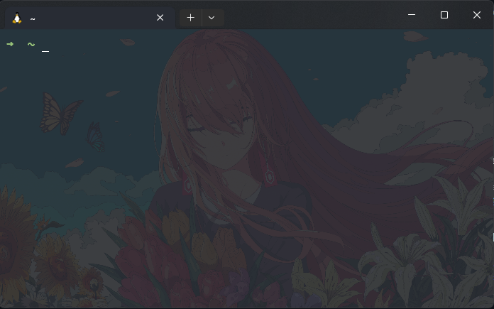

Color scheme: One half dark  
ZSH theme: awesomepanda  
Font: MesloLGS NF (optional)  
BG image opacity: 10%  

[git](https://github.com/ohmyzsh/ohmyzsh/tree/master/plugins/git) | [zsh-autosuggestions](https://github.com/zsh-users/zsh-autosuggestions) | [zsh-syntax-highlighting](https://github.com/zsh-users/zsh-syntax-highlighting) | [you-should-use](https://github.com/MichaelAquilina/zsh-you-should-use)  
Absolute musts: [zoxide](https://github.com/ajeetdsouza/zoxide) | [fzf](https://github.com/junegunn/fzf).

Tweaks made to the original theme are the different color of the dir name, i hate cyan sry and it shows the whole path(i prefer it that way) instead of current dir only (which is kinda useless).

Powerlevel10k is overrated tho, might switch back to it in the future tho, so not deleting it from the config yet.  
Final Look:  

